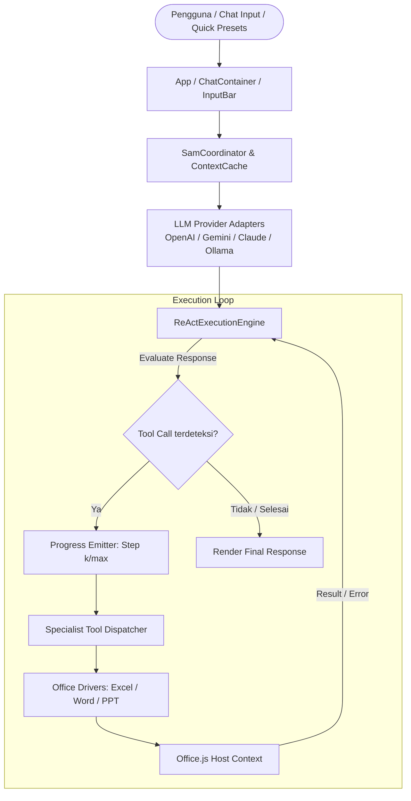

# Arsitektur & Desain Spesifikasi: Autonomous ReAct Engine, Optimasi Kecepatan, dan Kapabilitas Office Suite

**Tanggal**: 2026-09-21  
**Status**: Approved (Design Complete)  
**Tujuan**: Mentransformasi Sam Office Agent menjadi agen AI yang otonom (multi-turn ReAct), responsif (context caching & single-sync batching), serta aplikatif (ekspansi tool native Excel, Word, PowerPoint, dan Quick Action Presets).

---

## 1. Latar Belakang & Motivasi
Sam Office Agent saat ini memiliki kemampuan eksekusi script dinamis (*Self-Learning Meta-Tools*) dan tool dasar per host Office. Namun, alur pemanggilan tool masih didominasi interaksi *single-turn* (kecuali kelanjutan darurat untuk pembacaan slide/sheet), pemanggilan I/O Office.js selalu dilakukan sinkron di setiap percakapan tanpa caching, dan belum tersedianya tool native tingkat tinggi untuk tugas kantor esensial (pembersihan data, conditional formatting, pembuatan dokumen terstruktur, dan presentasi multi-slide tematik).

Penyempurnaan ini berfokus pada 3 pilar:
1. **Lebih Cepat**: Context snapshot caching berbasis *dirty-flag* dan Office.js batching (single `context.sync()`).
2. **Lebih Pintar**: Autonomous ReAct Engine multi-turn native dengan pelacak progress real-time (*Live Step Progress*) dan perbaikan otomatis (*Self-Correction*).
3. **Lebih Applicable**: Tool native tingkat tinggi untuk Microsoft Excel, Word, dan PowerPoint serta Quick Action Presets Toolbar di UI.

---

## 2. Arsitektur Komponen



---

## 3. Spesifikasi Detail Komponen

### 3.1. Schema Data & Protokol LLM (`src/types/index.ts`)
Pembaruan antarmuka data agar mendukung siklus multi-turn tool call lintas provider:
```typescript
export interface ChatMessage {
  id: string;
  role: 'user' | 'assistant' | 'system' | 'tool';
  content: string;
  displayContent?: string;
  timestamp: number;
  toolCalls?: ToolCall[];
  toolCallId?: string; // Diisi saat role: 'tool'
  toolName?: string;
  isError?: boolean;
  status?: 'sending' | 'streaming' | 'done' | 'error';
  error?: string;
}
```

Adapter di `src/services/llm/`:
- **OpenAI, GLM, Ollama**: Menggunakan format `tool_calls` pada role assistant dan role `tool` berpasangan dengan `tool_call_id`.
- **Google Gemini**: Menggunakan `functionCall` pada part model dan `functionResponse` pada part user.
- **Anthropic Claude**: Menggunakan `tool_use` blok pada assistant dan `tool_result` blok pada user.

### 3.2. Autonomous ReAct Engine (`src/agents/coordinator/reactEngine.ts`)
- **Safety Guard**: Maksimal 6 iterasi per tugas untuk mencegah siklus tanpa akhir.
- **Progress Tracking**: Memancarkan event progress ke UI (`[1/3] Membaca tabel...`, `[2/3] Membersihkan data kosong...`).
- **Self-Correction**: Jika suatu tool menghasilkan error (misal Office.js range invalid atau formula error), pesan error dimasukkan sebagai payload `role: 'tool'` dengan status error, sehingga model pada iterasi berikutnya dapat mengevaluasi dan memperbaiki parameter pemanggilan.

### 3.3. Document Context Snapshot Cache (`src/services/office/contextCache.ts`)
- Menyimpan snapshot ringkasan dokumen di memori klien dengan timestamp.
- Menghindari pembacaan IPC WebView2 ke Office.js jika pengguna hanya berdiskusi atau meminta klarifikasi.
- **Auto-invalidation**: Direset/dinyatakan kotor (*dirty*) seketika saat tool modifikasi data (`write_cells`, `clean_data`, `insert_content`, `create_slide`) berhasil dieksekusi.

### 3.4. Ekspansi Specialist Native Tools

#### A. Microsoft Excel (`src/agents/excel/excelAgent.ts`)
- **`clean_data`**:
  - Parameter: `range` (opsional), `removeDuplicates` (boolean), `trimWhitespace` (boolean), `fillEmptyValues` (string/number opsional).
  - Eksekusi: Komputasi cepat di memori, batch penulisan kembali dalam 1 siklus `context.sync()`.
- **`apply_conditional_formatting`**:
  - Parameter: `range` (string), `type` (`'color_scale'` | `'data_bar'` | `'highlight_threshold'`), `color` (string opsional).
  - Memberikan visualisasi langsung pada nilai data numerik.

#### B. Microsoft Word (`src/agents/word/wordAgent.ts`)
- **`generate_structured_doc`**:
  - Parameter: `templateType` (`'SOP'` | `'MoM'` | `'SPK'` | `'PRD'` | `'FormalMemo'`), `title` (string), `sections` (array heading, teks, bullet, tabel).
  - Menyisipkan dokumen berstandar kantor lengkap dengan heading hierarkis dan penataan rapi.
- **`polish_document_text`**:
  - Parameter: `scope` (`'selection'` | `'document'`), `tone` (`'formal_indonesia'` | `'executive_english'` | `'concise'`).
  - Merevisi teks terpilih sesuai standar tata bahasa resmi korporat.

#### C. Microsoft PowerPoint (`src/agents/powerpoint/pptAgent.ts`)
- **`generate_themed_deck`**:
  - Parameter: `topic` (string), `theme` (`'corporate_blue'` | `'emerald_executive'` | `'modern_dark'` | `'minimalist_clean'`), `slides` (array judul, layout: `'title_cover'` | `'split_comparison'` | `'bullet_points'` | `'metric_highlights'`, catatan pemateri opsional).
  - Membuat presentasi yang estetis dan siap dibawakan.

#### D. Quick Action Presets Toolbar (`src/components/Chat/QuickActionPresets.tsx`)
- Toolbar responsif di atas `InputBar` yang menyesuaikan host aktif (Excel / Word / PPT).
- Menghadirkan pintasan 1-klik untuk tugas-tugas kantor favorit.

---

## 4. Keamanan, Privasi & Kendala Teknis
- **100% Client-Side BYOK**: Tidak ada server relay, proxy backend, atau pengumpulan telemetri.
- **Office.js Limitations Guard**: Melindungi dari API yang tidak didukung (seperti batasan notesPage PowerPoint) dengan instruksi sistem prompt yang ketat.
- **Backward Compatibility**: Semua percakapan yang ada dan tool custom bawaan tetap berfungsi penuh.

---

## 5. Rencana Verifikasi & Pengujian
- Unit test untuk `ReActExecutionEngine` (skenario sukses, multi-step, dan self-correction saat tool gagal).
- Unit test untuk `ContextCache` (skenario cache hit, TTL, dan auto-invalidation setelah tool tulis).
- Unit test untuk adapter LLM (pemetaan payload tool multi-turn untuk OpenAI, Gemini, Claude).
- Unit test untuk tool baru: `clean_data`, `apply_conditional_formatting`, `generate_structured_doc`, `generate_themed_deck`.
- Uji integrasi end-to-end simulasi alur asisten di browser dev mode (`npm test` / Vitest).
